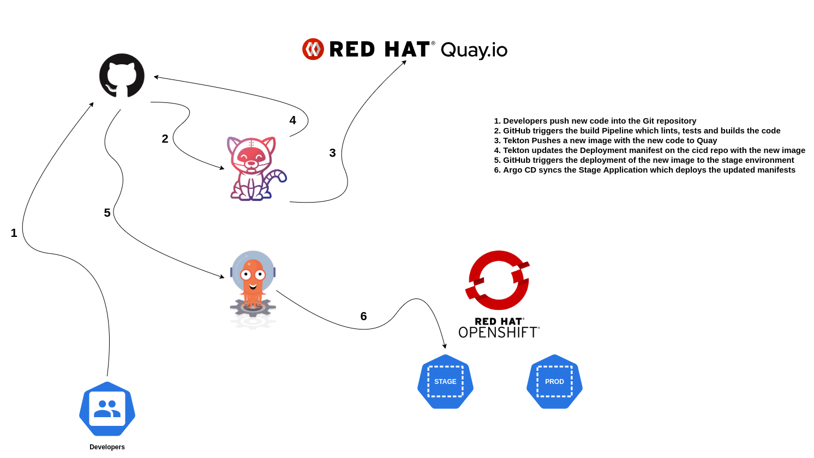
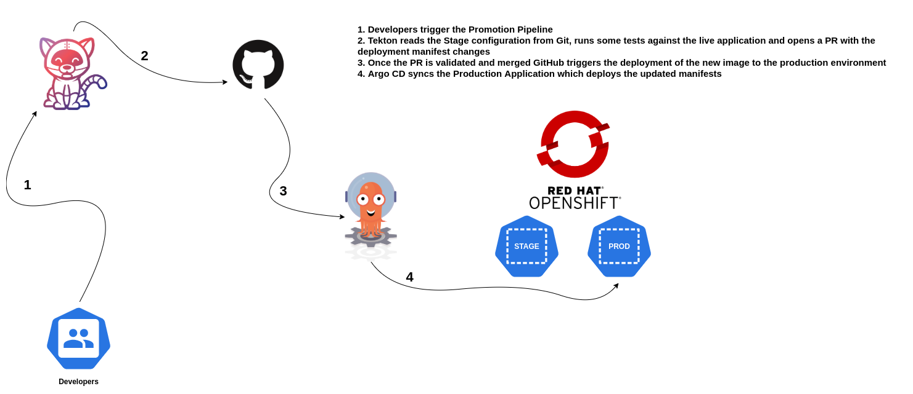

# Demo Workflows

## Build Workflow

## Image Promotion Workflow

# Argo CD

## Configuring the Argo CD Apps

1. Add the Git repository for our application to Argo CD

    > **NOTE**: Use your fork on the command below

    ~~~sh
    argocd repo add https://github.com/<github_username>/reverse-words-cicd.git --name reversewords-cicd
    ~~~
2. Edit the ingresses for our applications before creating them in Argo CD

    > **NOTE**: Update the ingresses on your fork to match your environment hostnames

    ~~~sh
    cd /var/tmp/code-to-prod-demo/reverse-words-cicd
    CLUSTER_WILDCARD=$(oc get ingresses.config.openshift.io cluster -o jsonpath='{ .spec.domain }')
    # Stash previous changes
    git stash
    # Update staging ingress  
    git checkout stage
    sed -i "s/host: .*/host: reversewords-dev.${CLUSTER_WILDCARD}/" ingress.yaml
    # Push stage changes
    git commit -am "Added ingress hostname"
    git push origin stage
    # Update production ingress
    git checkout prod
    sed -i "s/host: .*/host: reversewords-prod.${CLUSTER_WILDCARD}/" ingress.yaml
    # Push prod changes
    git commit -am "Added ingress hostname"
    git push origin prod
    ~~~
3. Define Development application

    > **NOTE**: Use your fork on the command below

    ~~~sh
    argocd app create --project default --name reverse-words-stage \
    --repo https://github.com/<github_username>/reverse-words-cicd.git \
    --path . \
    --dest-server https://kubernetes.default.svc \
    --dest-namespace reverse-words-stage --revision stage \
    --self-heal --sync-policy automated
    ~~~
4. Define Production application

    > **NOTE**: Use your fork on the command below

    ~~~sh
    argocd app create --project default --name reverse-words-production \
    --repo https://github.com/<github_username>/reverse-words-cicd.git \
    --path . \
    --dest-server https://kubernetes.default.svc \
    --dest-namespace reverse-words-production --revision prod \
    --self-heal --sync-policy automated
    ~~~
5. At this point the applications will be deployed automatically and Argo CD will poll the Git repository in order to detect configuration drifts every 3 minutes, when that happens, Argo CD will automatically apply the config stored in Git

## Triggering the Build Pipeline using the WebHook

We are going to use WebHooks in order to run Pipelines automatically when new commits hit the branches of our app and cicd repositories.

* Our first webhook will receive events from the application repository, when new code hits the main branch we will trigger the build pipeline.
* Our second webhook will receive events from the cicd repository, when new code hits `stage` or `prod` branches we will trigger a new deployment using Argo CD.

1. We will configure the first webhook on the app repo

    > **NOTE**: Every Git server has its own properties, but basically you want to provide the ingress url for our webhook and when the Git server should send the hook. E.g: push events, PR events, etc.

    1. Go to your application repository on GitHub, eg: https://github.com/<github_username>/reverse-words
    2. Click on `Settings` -> `Webhooks`
    3. Create the following `Hook`
       1. `Payload URL`: Output of command `oc -n <userXY>-reversewords-ci get route reversewords-webhook -o jsonpath='https://{.spec.host}'`
       2. `Content type`: application/json
       2. `Secret`: v3r1s3cur3
       3. `Events`: Check **Push Events**, leave others blank
       4. `Active`: Check it
       5. `SSL verification`: Check  **Disable**
       6. Click on `Add webhook`
2. Now, we will configure the second webhook to react to changes on the cicd repository

    > **NOTE**: Argo CD comes with Webhooks enabled by default, that means that we just need to use the following url as Webhook endpoint, `https://<argocd-ingress-url>/api/webhook`

    1. Go to your cicd repository on GitHub, eg: https://github.com/<github_username>/reverse-words-cicd
    2. Click on `Settings` -> `Webhooks`
    3. Create the following `Hook`
       1. `Payload URL`: Output of command `oc -n <userXY>-argocd get route argocd -o jsonpath='https://{.spec.host}'/api/webhook` 
       2. `Content type`: application/json
       2. `Secret`: v3r1s3cur3
       3. `Events`: Check **Push Events**, leave others blank
       4. `Active`: Check it
       5. `SSL verification`: Check  **Disable**
       6. Click on `Add webhook`
    4. We need to configure our `Secret Token` on Argo CD
        ~~~sh
        WEBHOOK_SECRET="v3r1s3cur3"
        oc -n <userXY>-argocd patch secret argocd-secret -p "{\"data\":{\"webhook.github.secret\":\"$(echo -n $WEBHOOK_SECRET | base64)\"}}" --type=merge
        ~~~
3. Now we should have a working Webhook, let's test it

    1. Deploy tkn cli
        
        ~~~sh
        sudo curl -L https://github.com/tektoncd/cli/releases/download/v0.10.0/tkn_0.10.0_Linux_x86_64.tar.gz | tar xz tkn 
        chown root: tkn && mv tkn /usr/bin/
        ~~~
    2. We need to commit to the main branch, let's update the release number
     
        ~~~sh
        cd /var/tmp/code-to-prod-demo/reverse-words/
        CURRENT_RELEASE=$(grep "var version" main.go  | awk -F '"' '{print $2}' | awk -F "." 'BEGIN{FS=OFS="."}{NF--; print}')
        NEW_MINOR=$(grep "var version" main.go  | awk -F '"' '{print $2}' | awk -F "." '{print $NF+1}')
        NEW_RELEASE="${CURRENT_RELEASE}.${NEW_MINOR}"
        sed -i "s|var version = .*|var version = \"${NEW_RELEASE}\"|" main.go
        git diff main.go
        git add main.go
        git commit -m "Release updated to $NEW_RELEASE"
        git push origin main
        ~~~
    3. Connect to the OpenShift Developer Console and navigate to the `<userXY>-reversewords-ci` namespace
       1. You can see the PipelineRun on the console and follow the log 
    4. We can check the running images for our application pod and see that when the pipeline finishes a new deployment is triggered on ArgoCD
    5. When the Build pipeline finishes we can promote the new build to production

        ~~~sh
        tkn -n <userXY>-reversewords-ci pipeline start reverse-words-promote-pipeline -r app-git=reverse-words-cicd-git -p pathToDeploymentFile=./deployment.yaml -p stageBranch=stage -p stageAppUrl=$(oc -n <userXY>-reverse-words-stage get route -l app=reversewords-stage -o jsonpath='{.items[*].spec.host}')
        ~~~

## Tekton Polling Operator

[Project Repository](https://github.com/bigkevmcd/tekton-polling-operator)

Sometimes your clusters cannot be accessed from the Internet, thus, webhooks won't be a valid option for automatically run our pipelines upon git changes. In this scenario we can use the `Tekton Polling Operator` which will poll our repo in a given time interval and run the Pipeline when needed.

You can run the polling operators in two ways:

1. Deploy a polling operator in the namespace where the Pipeline definitions are created
2. Deploy a global polling operator and give it access to the different namespaces with Pipelines definitions

We are going to follow the second approach.

> **NOTE**: Tekton Pipelines must be deployed in the cluster before deploying the operator

1. Create a namespace and deploy the operator

    ~~~sh
    oc create namespace tekton-polling-operator
    oc -n tekton-polling-operator apply -f https://github.com/bigkevmcd/tekton-polling-operator/releases/download/v0.2.0/release-v0.2.0.yaml
    ~~~
2. Create the required ClusterRole and ClusterRoleBinding for the Operator to create PipelineRuns on the reversewords-ci namespace

    ~~~sh
    cat <<EOF | oc create -f -
    apiVersion: rbac.authorization.k8s.io/v1
    kind: ClusterRole
    metadata:
      name: polling-operator-cluster-role
    rules:
    - apiGroups:
      - tekton.dev
      resources:
      - pipelineruns
      verbs:
      - create
    ---
    apiVersion: rbac.authorization.k8s.io/v1
    kind: RoleBinding
    metadata:
      name: polling-operator-role
      namespace: reversewords-ci
    roleRef:
      apiGroup: rbac.authorization.k8s.io
      kind: ClusterRole
      name: polling-operator-cluster-role
    subjects:
    - kind: ServiceAccount
      name: tekton-polling-operator
      namespace: tekton-polling-operator
    EOF
    ~~~
3. Patch the default ServiceAccount in the reversewords-ci namespace so it has access to the quay secret (this is required since polling operator still doesn't support defining ServiceAccounts for specific steps)

    ~~~sh
    oc -n reversewords-ci patch serviceaccount pipeline -p '{"secrets":[{"name":"quay-user-pass"}]}'
    ~~~
4. Create the repository object for polling

    ~~~sh
    cat <<EOF | oc -n tekton-polling-operator create -f -
    apiVersion: polling.tekton.dev/v1alpha1
    kind: Repository
    metadata:
      name: reversewords-repository
    spec:
      url: https://github.com/tgubeli/reverse-words.git
      ref: main
      frequency: 1m
      type: github
      pipelineRef:
        name: reverse-words-build-pipeline
        namespace: reversewords-ci
        params:
        - name: imageTag
          expression: commit.sha
        - name: repoSha
          expression: commit.sha
        - name: repoUrl
          expression: repoURL
        resources:
        - name: app-git
          resourceSpec:
            type: git
            params:
            - name: url
              value: \$(params.repoUrl)
            - name: revision
              value: \$(params.repoSha)
        - name: app-image
          resourceSpec:
            type: image
            params:
            - name: url
              value: "quay.io/mavazque/tekton-reversewords"
    EOF
    ~~~

## Sealed Secrets

Most of the time, our applications require Secrets to work properly, pushing Kubernetes secrets to a Git repository is not the way to go, as you probably know, Kubernetes secrets are encoded and not encrypted.

In order to solve this problem we are going to use Sealed Secrets, there are other alternatives out there like Vault secrets, the idea is uploading encrypted secrets to Git so they cannot be read by non-allowed users.

1. Download the Sealed Secrets Cli tool

    ~~~sh
    # Get the KubeSeal Cli and place it in /usr/bin/
    sudo curl -L https://github.com/bitnami-labs/sealed-secrets/releases/download/v0.12.4/kubeseal-linux-amd64 -o /usr/bin/kubeseal
    sudo chmod +x /usr/bin/kubeseal
    ~~~
2. Deploy the KubeSeal Controller into the cluster

    ~~~sh
    oc -n kube-system apply -f https://github.com/bitnami-labs/sealed-secrets/releases/download/v0.12.4/controller.yaml
    ~~~
3. Create a test secret

    ~~~sh
    cd /var/tmp/code-to-prod-demo/reverse-words-cicd
    # Stash previous changes
    git stash
    # Update staging ingress
    git checkout stage
    # Get updates
    git pull origin stage
    # Create the secret on a yaml file
    oc -n reverse-words-stage create secret generic my-test-secret --from-literal=username=admin --from-literal=password=v3r1s3cur3 --dry-run=client -o yaml > /tmp/test-secret.yaml
    ~~~
4. Seal the test secret

    ~~~sh
    kubeseal -o yaml < /tmp/test-secret.yaml > test-secret-sealed.yaml
    ~~~
5. Update the Kustomization and push the sealed secret to the git repository

    ~~~sh
    sed -i "s|patchesStrategicMerge:|- test-secret-sealed.yaml\npatchesStrategicMerge:|" kustomization.yaml
    git add kustomization.yaml test-secret-sealed.yaml
    git commit -m "Add Sealed Secret"
    git push origin stage
    ~~~
